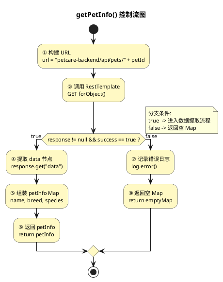

# 大模型微服务（llm-backend）白盒测试

> **测试对象**：`llm-backend/src/main/java/com/example/demo/resolver/PetHealthResolver.java`  
> **分析方法**：控制流图 + N-S图 + 分支覆盖测试用例  
> **分析日期**：2026-05-19

---

## 代码段一：`getPetInfo()` — 获取宠物基本信息（第105-117行）

```java
// 文件: llm-backend/src/main/java/com/example/demo/resolver/PetHealthResolver.java
// 行号: 105-117

private Map<String, Object> getPetInfo(String petId) {                 // 行105
    String url = "http://petcare-backend/api/pets/" + petId;           // 行106
    try {                                                               // 行107
        JsonNode response = loadBalancedRestTemplate                    // 行108
                .getForObject(url, JsonNode.class);
        if (response != null && response.get("success").asBoolean()) { // 行109 ★分支
            JsonNode data = response.get("data");                       // 行110
            Map<String, Object> petInfo = new HashMap<>();              // 行111
            petInfo.put("name", data.get("name").asText());             // 行112
            petInfo.put("breed", data.get("breed").asText());           // 行113
            petInfo.put("species", data.get("species").asText());       // 行114
            return petInfo;                                             // 行115 ← 正常出口
        }
    } catch (Exception e) {                                             // 行116
        log.error("获取宠物信息失败", e);                                // 行117
    }
    return Collections.emptyMap();                                      // 行118 ← 异常/失败出口
}
```

### 1.1 控制流图

#### PUML 版本（PlantUML）



#### Draw.io 版本（mxGraph XML）

```xml
<mxfile host="app.diagrams.net">
  <diagram name="getPetInfo-CFG">
    <mxGraphModel>
      <root>
        <mxCell id="0"/>
        <mxCell id="1" parent="0"/>

        <!-- 节点1: 开始 -->
        <mxCell id="n1" value="① 构建 URL" style="ellipse;fillColor=#FFF9C4;strokeColor=#333;" vertex="1" parent="1">
          <mxGeometry x="260" y="20" width="120" height="60"/>
        </mxCell>

        <!-- 节点2: API调用 -->
        <mxCell id="n2" value="② 调用 GET\nforObject()" style="ellipse;fillColor=#FFF9C4;strokeColor=#333;" vertex="1" parent="1">
          <mxGeometry x="260" y="110" width="120" height="60"/>
        </mxCell>

        <!-- 节点3: 判断 (菱形) -->
        <mxCell id="n3" value="③ response!=null\n&& success=true?" style="rhombus;fillColor=#FFE0B2;strokeColor=#333;" vertex="1" parent="1">
          <mxGeometry x="240" y="200" width="160" height="100"/>
        </mxCell>

        <!-- 节点4-6: 正常路径 -->
        <mxCell id="n4" value="④ 提取 data" style="ellipse;fillColor=#C8E6C9;strokeColor=#333;" vertex="1" parent="1">
          <mxGeometry x="420" y="210" width="120" height="50"/>
        </mxCell>
        <mxCell id="n5" value="⑤ 组装 petInfo\n(name/breed/species)" style="ellipse;fillColor=#C8E6C9;strokeColor=#333;" vertex="1" parent="1">
          <mxGeometry x="420" y="290" width="120" height="60"/>
        </mxCell>
        <mxCell id="n6" value="⑥ return petInfo" style="ellipse;fillColor=#A5D6A7;strokeColor=#333;" vertex="1" parent="1">
          <mxGeometry x="420" y="380" width="120" height="50"/>
        </mxCell>

        <!-- 节点7-8: 异常路径 -->
        <mxCell id="n7" value="⑦ 记录错误日志" style="ellipse;fillColor=#FFCDD2;strokeColor=#333;" vertex="1" parent="1">
          <mxGeometry x="80" y="310" width="120" height="50"/>
        </mxCell>
        <mxCell id="n8" value="⑧ return emptyMap()" style="ellipse;fillColor=#EF9A9A;strokeColor=#333;" vertex="1" parent="1">
          <mxGeometry x="80" y="390" width="120" height="50"/>
        </mxCell>

        <!-- 弧 (n1→n2) -->
        <mxCell id="e1" style="edgeStyle=none;endArrow=block;" edge="1" parent="1" source="n1" target="n2">
          <mxGeometry relative="1"/>
        </mxCell>

        <!-- 弧 (n2→n3) -->
        <mxCell id="e2" style="edgeStyle=none;endArrow=block;" edge="1" parent="1" source="n2" target="n3">
          <mxGeometry relative="1"/>
        </mxCell>

        <!-- 弧 a: true (n3→n4) -->
        <mxCell id="ea" value="a:true" style="edgeStyle=none;endArrow=block;fontColor=#2E7D32;" edge="1" parent="1" source="n3" target="n4">
          <mxGeometry relative="1"/>
        </mxCell>

        <!-- 弧 (n4→n5) -->
        <mxCell id="e3" style="edgeStyle=none;endArrow=block;" edge="1" parent="1" source="n4" target="n5">
          <mxGeometry relative="1"/>
        </mxCell>

        <!-- 弧 (n5→n6) -->
        <mxCell id="e4" style="edgeStyle=none;endArrow=block;" edge="1" parent="1" source="n5" target="n6">
          <mxGeometry relative="1"/>
        </mxCell>

        <!-- 弧 b: false/exception (n3→n7) -->
        <mxCell id="eb" value="b:false" style="edgeStyle=none;endArrow=block;fontColor=#C62828;" edge="1" parent="1" source="n3" target="n7">
          <mxGeometry relative="1"/>
        </mxCell>

        <!-- 弧 (n7→n8) -->
        <mxCell id="e5" style="edgeStyle=none;endArrow=block;" edge="1" parent="1" source="n7" target="n8">
          <mxGeometry relative="1"/>
        </mxCell>

      </root>
    </mxGraphModel>
  </diagram>
</mxfile>
```

### 1.2 N-S 图（盒图）

```
┌─────────────────────────────────────────────────────┐
│ ① 构建 URL = "http://petcare-backend/api/pets/" + petId │
├─────────────────────────────────────────────────────┤
│ ② 调用 loadBalancedRestTemplate.getForObject(url, ...) │
├─────────────────────────────────────────────────────┤
│                   ③ 判断                            │
│     response != null && response.get("success")     │
│              .asBoolean() == true?                  │
├──────────────────┬──────────────────────────────────┤
│    T (true)      │       F (false) / Exception      │
├──────────────────┼──────────────────────────────────┤
│ ④ 提取 data 节点 │   ⑦ 记录错误日志                  │
│ ⑤ 组装 petInfo   │   log.error("获取宠物信息失败", e) │
│    - name        │                                  │
│    - breed       │                                  │
│    - species     │                                  │
├──────────────────┼──────────────────────────────────┤
│ ⑥ return petInfo │   ⑧ return Collections.emptyMap() │
└──────────────────┴──────────────────────────────────┘
```

### 1.3 分支覆盖测试用例

| Case ID | 输入（petId） | 预期输出 | 覆盖 Branch |
|---------|---------------|----------|-------------|
| W1-TC01 | `"1"`（存在于 petcare-backend 的宠物） | `Map<String,Object>` 含 `name`、`breed`、`species`，3 个字段均非空字符串 | ①→②→③a→④→⑤→⑥ |
| W1-TC02 | `"99999"`（不存在的宠物） | `Collections.emptyMap()`（大小=0），日志含"获取宠物信息失败" | ①→②→③b→⑦→⑧ |
| W1-TC03 | `"1"` + petcare-backend 服务宕机 | `Collections.emptyMap()`，RestTemplate 抛 `ResourceAccessException` 被 catch 捕获 | ①→②→(异常)→⑦→⑧ |

---

## 代码段二：`callQwenAI()` — 调用通义千问AI（第151-175行）

```java
// 文件: llm-backend/src/main/java/com/example/demo/resolver/PetHealthResolver.java
// 行号: 151-175

private String callQwenAI(String prompt) {                              // 行151
    String url = "https://dashscope.aliyuncs.com/...";                  // 行152
    Map<String, Object> request = new HashMap<>();                       // 行153
    request.put("model", "qwen3-max");                                   // 行154
    request.put("messages", List.of(Map.of(                             // 行155
            "role", "user", "content", prompt)));                        // 行156
    try {                                                                // 行157
        HttpHeaders headers = new HttpHeaders();                         // 行158
        headers.set("Authorization", "Bearer " + QWEN_API_KEY);          // 行159
        headers.set("Content-Type", "application/json");                 // 行160
        HttpEntity<Map<String, Object>> entity =                         // 行161
                new HttpEntity<>(request, headers);                       // 行162
        JsonNode response = normalRestTemplate                           // 行163
                .postForObject(url, entity, JsonNode.class);             // 行164
        if (response != null && response.has("choices")) {               // 行165 ★分支1
            JsonNode choices = response.get("choices");                  // 行166
            if (choices.isArray() && choices.size() > 0) {               // 行167 ★分支2
                return choices.get(0)                                    // 行168
                        .get("message").get("content").asText();         // 行169 ← 正常出口
            }
        }
    } catch (Exception e) {                                              // 行170
        log.error("Qwen AI调用失败", e);                                  // 行171
    }
    return "无法生成健康建议，请稍后重试。";                                // 行172 ← 异常/降级出口
}
```

### 2.1 控制流图

#### PUML 版本

```plantuml
@startuml
skinparam defaultFontSize 11
skinparam activityBorderColor #333333
skinparam activityBackgroundColor #FFF9C4
skinparam activityFontColor #000000

title callQwenAI() 控制流图

(*) --> "① 构建请求体\nmodel=\"qwen3-max\"\n+ prompt 消息"
"① 构建请求体\nmodel=\"qwen3-max\"\n+ prompt 消息" --> "② 设置 Auth Header\nAuthorization Bearer + APIKey"
"② 设置 Auth Header\nAuthorization Bearer + APIKey" --> "③ 发送 POST 请求\npostForObject(url, entity)"
"③ 发送 POST 请求\npostForObject(url, entity)" --> ④

if "④ response!=null\n&& has(\"choices\")\na: true / b: false" then
  -a-> "⑤ 获取 choices 数组"
  --> ⑥
  if "⑥ choices.isArray()\n&& size()>0\nc: true / d: false" then
    -c-> "⑦ 提取 message.content\nchoices[0].message.content"
    --> "⑧ return content\n(正常AI回复文本)"
    --> (*)
  else
    -d-> "⑨ 返回降级文本\n\"无法生成健康建议...\""
    --> (*)
  endif
else
  -b-> "⑩ catch Exception\nlog.error(AI调用失败)"
endif

"⑩ catch Exception\nlog.error(AI调用失败)" --> "⑨ 返回降级文本\n\"无法生成健康建议...\""

note right of ④
  分支条件:
  a (true): 有 choices
  b (false): 无 choices/异常
end note

note right of ⑥
  分支条件:
  c (true): 数组非空
  d (false): 数组为空
end note

@enduml
```

#### Draw.io 版本

```xml
<mxfile host="app.diagrams.net">
  <diagram name="callQwenAI-CFG">
    <mxGraphModel>
      <root>
        <mxCell id="0"/>
        <mxCell id="1" parent="0"/>

        <!-- 节点1-3 -->
        <mxCell id="n1" value="① 构建请求体" style="ellipse;fillColor=#FFF9C4;strokeColor=#333;" vertex="1" parent="1">
          <mxGeometry x="260" y="10" width="120" height="55"/>
        </mxCell>
        <mxCell id="n2" value="② 设置 Auth Header" style="ellipse;fillColor=#FFF9C4;strokeColor=#333;" vertex="1" parent="1">
          <mxGeometry x="260" y="85" width="120" height="55"/>
        </mxCell>
        <mxCell id="n3" value="③ POST 请求\npostForObject()" style="ellipse;fillColor=#FFF9C4;strokeColor=#333;" vertex="1" parent="1">
          <mxGeometry x="260" y="160" width="120" height="55"/>
        </mxCell>

        <!-- 节点4: 判断1 -->
        <mxCell id="n4" value="④ response!=null\n&& has(\"choices\")?" style="rhombus;fillColor=#FFE0B2;strokeColor=#333;" vertex="1" parent="1">
          <mxGeometry x="230" y="245" width="180" height="90"/>
        </mxCell>

        <!-- 节点5: 获取choices -->
        <mxCell id="n5" value="⑤ 获取 choices" style="ellipse;fillColor=#C8E6C9;strokeColor=#333;" vertex="1" parent="1">
          <mxGeometry x="420" y="255" width="110" height="50"/>
        </mxCell>

        <!-- 节点6: 判断2 -->
        <mxCell id="n6" value="⑥ isArray()\n&& size()>0?" style="rhombus;fillColor=#FFE0B2;strokeColor=#333;" vertex="1" parent="1">
          <mxGeometry x="410" y="335" width="140" height="80"/>
        </mxCell>

        <!-- 节点7-8: 正常 -->
        <mxCell id="n7" value="⑦ 提取\nmessage.content" style="ellipse;fillColor=#C8E6C9;strokeColor=#333;" vertex="1" parent="1">
          <mxGeometry x="540" y="330" width="110" height="55"/>
        </mxCell>
        <mxCell id="n8" value="⑧ return content" style="ellipse;fillColor=#A5D6A7;strokeColor=#333;" vertex="1" parent="1">
          <mxGeometry x="540" y="410" width="110" height="45"/>
        </mxCell>

        <!-- 节点9: 降级出口 -->
        <mxCell id="n9" value="⑨ return 降级文本\n\"无法生成...\"" style="ellipse;fillColor=#EF9A9A;strokeColor=#333;" vertex="1" parent="1">
          <mxGeometry x="80" y="405" width="130" height="55"/>
        </mxCell>

        <!-- 节点10: 异常 -->
        <mxCell id="n10" value="⑩ catch Exception\nlog.error()" style="ellipse;fillColor=#FFCDD2;strokeColor=#333;" vertex="1" parent="1">
          <mxGeometry x="80" y="285" width="130" height="55"/>
        </mxCell>

        <!-- 弧 n1→n2→n3→n4 -->
        <mxCell id="e1" style="edgeStyle=none;endArrow=block;" edge="1" parent="1" source="n1" target="n2"/>
        <mxCell id="e2" style="edgeStyle=none;endArrow=block;" edge="1" parent="1" source="n2" target="n3"/>
        <mxCell id="e3" style="edgeStyle=none;endArrow=block;" edge="1" parent="1" source="n3" target="n4"/>

        <!-- a: true n4→n5 -->
        <mxCell id="ea" value="a:true" style="edgeStyle=none;endArrow=block;fontColor=#2E7D32;" edge="1" parent="1" source="n4" target="n5"/>
        <!-- n5→n6 -->
        <mxCell id="e4" style="edgeStyle=none;endArrow=block;" edge="1" parent="1" source="n5" target="n6"/>

        <!-- c: true n6→n7 -->
        <mxCell id="ec" value="c:true" style="edgeStyle=none;endArrow=block;fontColor=#2E7D32;" edge="1" parent="1" source="n6" target="n7"/>
        <mxCell id="e5" style="edgeStyle=none;endArrow=block;" edge="1" parent="1" source="n7" target="n8"/>

        <!-- d: false n6→n9 -->
        <mxCell id="ed" value="d:false" style="edgeStyle=none;endArrow=block;fontColor=#C62828;fontSize=10;" edge="1" parent="1" source="n6" target="n9"/>

        <!-- b: false/exception n4→n10 -->
        <mxCell id="eb" value="b:false/异常" style="edgeStyle=none;endArrow=block;fontColor=#C62828;fontSize=10;" edge="1" parent="1" source="n4" target="n10"/>
        <!-- n10→n9 -->
        <mxCell id="e6" style="edgeStyle=none;endArrow=block;" edge="1" parent="1" source="n10" target="n9"/>

      </root>
    </mxGraphModel>
  </diagram>
</mxfile>
```

### 2.2 N-S 图（盒图）

```
┌──────────────────────────────────────────────────────┐
│ ① 构建请求体：Map {model:"qwen3-max", messages:[...]} │
├──────────────────────────────────────────────────────┤
│ ② 设置 HTTP Header：Authorization Bearer + APIKey     │
├──────────────────────────────────────────────────────┤
│ ③ 发送 POST 请求到 dashscope.aliyuncs.com             │
├──────────────────────────────────────────────────────┤
│                   ④ 判断                             │
│ response != null && response.has("choices")?         │
├─────────────────────┬────────────────────────────────┤
│     T (true)        │      F (false) / Exception      │
├─────────────────────┼────────────────────────────────┤
│ ⑤ 获取 choices 数组 │  ⑩ catch Exception              │
├─────────────────────┤  log.error("Qwen AI调用失败")   │
│       ⑥ 判断        │                                │
│ choices.isArray()   │                                │
│ && size()>0?        │                                │
├─────────┬───────────┤                                │
│ T (true)│ F (false) │                                │
├─────────┼───────────┼────────────────────────────────┤
│ ⑦ 提取  │           │  ⑨ return 降级文本               │
│choices[0]│          │  "无法生成健康建议，请稍后重试。"  │
│.message  │          │                                │
│.content  │          │                                │
├─────────┴───────────┴────────────────────────────────┤
│ ⑧ 正常返回 AI 回复文本                                │
└──────────────────────────────────────────────────────┘
```

### 2.3 分支覆盖测试用例

| Case ID | 输入（prompt 示例） | 前置条件 | 预期输出 | 覆盖 Branch |
|---------|---------------------|----------|----------|-------------|
| W2-TC01 | `"请分析一只3岁金毛的健康状况"` | Qwen API Key 有效，网络可达 | 返回非空的 AI 健康建议文本（中文），长度 > 50 字符 | ①→②→③→④a→⑤→⑥c→⑦→⑧ |
| W2-TC02 | `""`（空 prompt） | Qwen API Key 有效 | AI 返回的文本（取决于模型对空 prompt 的响应，通常仍返回一些内容），不会是降级文本 | ①→②→③→④a→⑤→⑥c→⑦→⑧ |
| W2-TC03 | `"请分析一只3岁金毛的健康状况"` | Qwen API Key **无效**（伪造的 Key） | `"无法生成健康建议，请稍后重试。"`（HTTP 401 → 异常 → 降级出口） | ①→②→③→(异常)→⑩→⑨ |
| W2-TC04 | `"请分析一只3岁金毛的健康状况"` | Qwen API 返回 HTTP 200 但 body 中无 `"choices"` 字段（模拟畸形响应） | `"无法生成健康建议，请稍后重试。"` | ①→②→③→④b→⑨ |

---

## 附录：分支编号总览

### Segment 1 (`getPetInfo`)

| Node | 操作 | Branch |
|------|------|--------|
| ① | 构建 URL | — |
| ② | 调用 `getForObject()` | — |
| ③ | `response != null && success == true` | a: T → ④；b: F/异常 → ⑦ |
| ④ | 提取 data | — |
| ⑤ | 组装 Map | — |
| ⑥ | `return petInfo` | 正常出口 |
| ⑦ | `log.error()` | — |
| ⑧ | `return emptyMap()` | 异常/失败出口 |

### Segment 2 (`callQwenAI`)

| Node | 操作 | Branch |
|------|------|--------|
| ① | 构建请求体 | — |
| ② | 设置 Auth Header | — |
| ③ | 发送 POST | — |
| ④ | `response!=null && has("choices")` | a: T → ⑤；b: F/异常 → ⑩ |
| ⑤ | 获取 choices | — |
| ⑥ | `isArray() && size()>0` | c: T → ⑦；d: F → ⑨ |
| ⑦ | 提取 `message.content` | — |
| ⑧ | `return content` | 正常出口 |
| ⑨ | `return 降级文本` | 降级出口 |
| ⑩ | `catch Exception` | 异常处理 |
