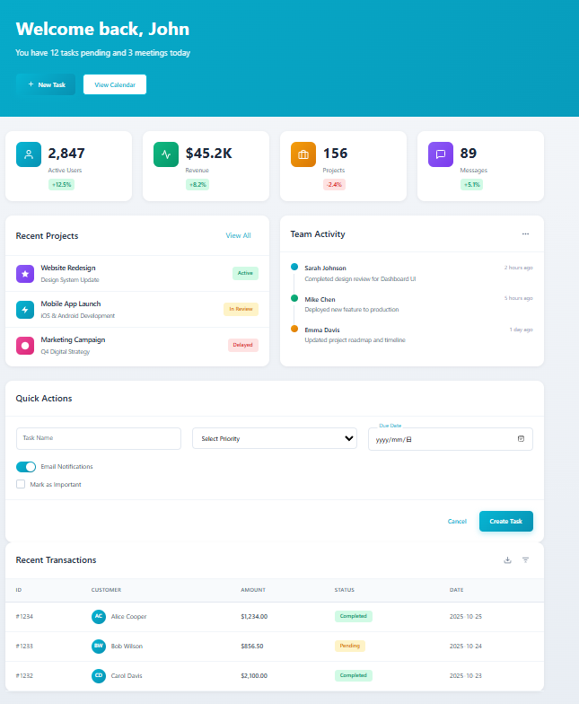
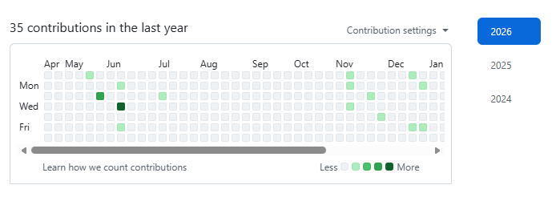

任务列表：

----整体----
1.header的跳转按钮没有边缘，可以给它加一个边框，然后悬浮或者在当前页面的时候显示为蓝色
2.给所有页面添加一个侧边栏，可以展开和收起，默认展开的那种，然后显示所有的导航，展开一个导航可以看到二级组件，点击即可跳转到对应的页面的对应组件的位置。
侧边栏风格：
- 使用 3-4 种主色构成线性/径向渐变叠加，避免彩虹杂乱，可叠加轻微噪点。
- 背景可采用大角度渐变或径向光晕，前景卡片用纯色或弱渐变，与背景形成层次。
- 保持大字号标题与充足留白，网格对齐；按钮与标签可用渐变描边或渐变填充。
- 交互态用色相/亮度渐变过渡，动画 200-300ms 内完成，确保可访问性对比

前端风格：
----首页----
角色设定：你是亲自然设计师，将动物、植物、有机形状与自然光感带入界面。
场景定位：可持续/健康/户外/冥想产品。
视觉设计理念：绿植色盘（苔绿、叶绿、土褐、天光蓝），有机曲线与柔和渐变；插画/线稿动物、植物点缀。留白充足，文字高对比。
材质与质感：纸纤维/叶脉轻纹理，柔和阴影，少用玻璃；可用淡色渐变背景加微噪点。
交互体验：Hover 亮度微升，如光线移动；Active 轻微下沉；节奏 150-220ms。
整体氛围：平静、自然、疗愈，像阳光洒落的绿植空间。
首页的修改意见：
1.第一个组件内容有一些空，加一点文字，可以简单介绍我们的系统；然后开始使用这个按钮使用- 天空蓝（bg-sky-400, #38bdf8）这个颜色。
2.第一个组件可以加一些仪表盘，如果用户已登录，则显示用户的宠物数量，宠物活动数量等信息（这里可以你来规划）；如果用户未登录，则显示“请您先登录”等信息。

### 核心特征
- 自然配色：绿色系（#16a34a, #22c55e, #84cc16）、土色系（#78350f, #92400e）、天空蓝（#0ea5e9）
- 有机形状：使用 rounded-3xl 或不规则 SVG clip-path 模拟自然曲线
- 动物元素：首页的第一个组件还是放咱们vue里图中的动物
- 自然纹理：使用背景图案（木纹、石纹、草地纹理）
- 柔和阴影：shadow-md 模拟自然光线
- 流动布局：避免僵硬的网格，使用 asymmetric layout

### 组件设计
**卡片**：p-8 bg-green-50 rounded-3xl shadow-md，边缘装饰叶子图案
**按钮**：px-8 py-4 bg-green-600 text-white rounded-full，hover:bg-green-700
**图片框**：rounded-2xl overflow-hidden，配合自然场景照片
**分隔线**：使用藤蔓SVG图案代替直线

### 排版
- 字体：font-serif（Lora, Georgia）或 font-sans（Quicksand）
- 标题：text-4xl font-semibold text-green-900
- 正文：text-lg text-gray-700 leading-relaxed
- 引用：italic text-green-800

### 配色（自然系）
- 森林绿（bg-green-700, #15803d）
- 草地绿（bg-green-500, #22c55e）
- 薄荷绿（bg-green-100, #dcfce7）
- 土棕色（bg-amber-800, #92400e）
- 天空蓝（bg-sky-400, #38bdf8）
- 米白色（bg-stone-50, #fafaf9）

### 自然元素
- 叶子图标：简化的叶片形状，使用 SVG path
- 树木轮廓：用作背景装饰
- 藤蔓边框：环绕卡片边缘
- 水滴形状：用于加载动画或装饰点
- 阳光光线：使用径向渐变（bg-gradient-radial from-yellow-200）

### 交互
- 生长动画：scale-0 → scale-100 模拟植物生长
- 叶子飘落：使用 animate-float 上下飘动
- 柔和过渡：transition-all duration-500 ease-out
- hover 效果：轻微放大 + 阴影增强

### 实现示例
```html
<div class="relative p-10 bg-green-50 rounded-3xl shadow-md">
  <div class="absolute top-0 right-0 w-24 h-24 opacity-20">
    <!-- Leaf SVG decoration -->
    <svg viewBox="0 0 100 100">
      <path d="M50,10 Q70,30 50,90 Q30,30 50,10" fill="currentColor" class="text-green-600"/>
    </svg>
  </div>
  <h3 class="text-3xl font-semibold text-green-900 mb-4">Natural Living</h3>
  <p class="text-lg text-gray-700 leading-relaxed">Embrace nature in your design...</p>
  <button class="mt-6 px-8 py-3 bg-green-600 text-white rounded-full hover:bg-green-700 transition-colors duration-300">
    Explore Nature
  </button>
</div>
```

你可以参考这个图片，然后进行修改。

----首页----


----活动页----
页面：http://localhost:5173/activities
1.风格要求：设计一个遵循 Google Material Design 3 规范的现代化界面，强调层次感、动态表面和适应性色彩系统。

**核心设计原则**：
- **Material You 动态色彩**：从主题色种子生成完整的色调调色板，支持浅色/深色模式自动切换
- **海拔层级系统**：使用 5 级海拔（0dp、1dp、3dp、6dp、8dp、12dp）表达 UI 层次
- **状态层叠加**：hover、focus、pressed、dragged 状态通过半透明复盖层表达
- **形状系统**：圆角从 0dp（无）到 28dp（完全圆形）的 6 级形状比例

**视觉元素**：
- **表面容器**：带有微妙色调偏移的卡片（Surface、Surface Container、Surface Container High）
- **FAB 浮动按钮**：大型主要操作按钮，带有海拔阴影和涟漪效果
- **导航组件**：Navigation Rail（侧边栏）或 Bottom Navigation（底部导航）
- **Chip 标签**：输入型、过滤型、建议型、辅助型四种变体
- **文字排版**：使用 Roboto 字体家族，遵循 Type Scale（Display、Headline、Title、Body、Label）

**交互动效**：
- **涟漪效果（Ripple）**：所有可点击元素的触摸反馈，从触摸点扩散
- **容器变形**：卡片展开、缩合、位移的流畅动画（300-500ms）
- **共享轴动画**：页面切换时的向前/向后层次过渡
- **强调动画**：重要操作完成时的视觉确认（如勾选动画）

**页面结构**：
1. **顶部应用栏**：标题、导航图标、操作图标，支持滚动时收缩
2. **主内容区**：卡片式布局，使用 8dp 网格系统
3. **底部操作栏**：FAB 按钮和底部导航的组合
4. **抽屉导航**：Modal 或 Standard 抽屉式导航

**色彩方案**：
- 主色：Primary (#6750A4)、On Primary (#FFFFFF)
- 次要色：Secondary (#625B71)、Tertiary (#7D5260)
- 表面：Surface (#FEF7FF)、Surface Container (#F3EDF7)
- 错误：Error (#B3261E)
给你这个图片作为参考。
修改详情：
1.缺少了AI诊断报告的卡片，你可以对此添加一个组件对应后端的AI诊断报告接口。
2.添加一个类似于github活跃度的那个颜色仪表盘，示例图片我放在下面了


----宠物社区----
页面：http://localhost:5173/moments

----地图----
1.这是我自己的想法，新建一个地图页面，嵌入一个地图，然后根据用户选点或者搜索，自动显示该地点附近5公里内的宠物医院和宠物店等相关机构及信息，同时显示该宠物医院和宠物店的评分和评价。
2.这部分没有人做，所以可以我们自由发挥，加什么功能都可以，只要你觉得好。
3.别忘了在header上加入地图的导航按钮


